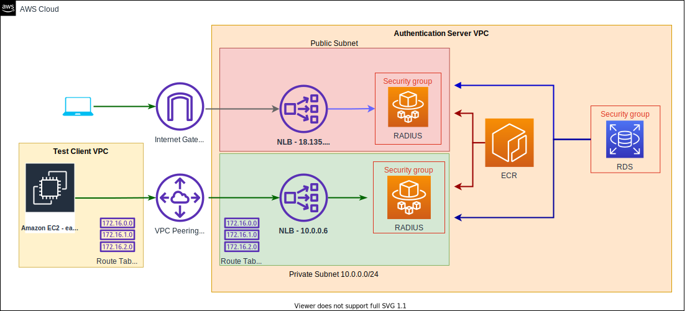

# Network Access Control Server

This is the RADIUS Server for managing Network Access Control.

## Table of Contents

- [Getting Started](#getting-started)
  - [Authenticating with DockerHub](#authenticating-with-dockerhub)
  - [Starting the App](#starting-the-app)
  - [Deployment](#deployment)
    - [Targetting the ECS Cluster and Service to Deploy](#targetting-the-ecs-cluster-and-service-to-deploy)
    - [Publishing Image from Local Machine](#publishing-image-from-local-machine)
- [User Flow and Diagrams](#user-flow-and-diagrams)
- [RADIUS Attribute Validation](#radius-attribute-validation)
- [Performance Testing](#performance-testing)
- [What triggers a deployment of the Radius server from the Admin Portal?](#what-triggers-a-deployment-of-the-radius-server-from-the-admin-portal)

## Getting Started

### Authenticating with DockerHub


Local development shouldn't go over the download limits of Dockerhub.
https://docs.docker.com/docker-hub/download-rate-limit/

If these limits are encountered, authenticating with Docker is required:

```
export DOCKER_USERNAME=your-docker-hub-username
export DOCKER_PASSWORD=your-docker-hub-password

make authenticate-docker
```

### Starting the App

1. To run the application locally, refer to the [Integration-Test](https://github.com/ministryofjustice/network-access-control-integration-tests) repository

### Public Key Infrastructure (PKI) Configuration

NACS does not support PKIs that require nonce to be configured. The CA certificates need to be installed on NACS and the OCSP endpoints need to be reachable. 
`use_nonce` has been disabled in NACS, and can not be conditionally set for new PKIs.
### Deployment

The `deploy` command is wrapped in a Makefile. It calls `./scripts/deploy` which schedules a zero downtime phased [deployment](https://docs.aws.amazon.com/AmazonECS/latest/developerguide/update-service.html) in ECS.

It doubles the currently running tasks and briefly serves traffic from the new and existing tasks in the service.
The older tasks are eventually decommissioned, and production traffic is gradually shifted over to only the new running tasks.

On CI this command is executed from the [buildspec.yml](./buildspec.yml) file after migrations and publishing the new image to ECR has been completed.

### Targetting the ECS Cluster and Service to Deploy

The ECS infrastructure is managed by Terraform. The name of the cluster and service are [outputs](https://www.terraform.io/docs/configuration/outputs.html) from the Terraform apply. These values are published to SSM Parameter Store, when this container is deployed it pulls those values from Parameter Store and sets them as environment variables.

The deploy script references these environment variables to target the ECS RADIUS service and cluster. This is to avoid depending on the hardcoded strings.

The build pipeline assumes a role to access the target AWS account.

#### Publishing Image from Local Machine

1. Export the following configurations as an environment variable.

```bash
  export NAC_TERRAFORM_OUTPUTS='{
    "radius": {
      "ecs": {
        "cluster_name": "[TARGET_CLUSTER_NAME]",
        "service_name": "[TARGET_SERVICE_NAME]"
      }
    }
  }'
```

This mimics what happens on CI where this environment variable is already set.

When run locally, you need to target the AWS account directly with AWS Vault.

2. Schedule the deployment

```bash
  aws-vault exec [target_aws_account_profile] -- make deploy
```

## User Flow and Diagrams

### Internal Authentication

### Other Diagrams
- [EAP User Flow Diagram](/docs/eap_user_flow_diagram.md)
- [RadSec User Flow Diagram](/docs/radsec_user_flow_diagram.md)
- [Policy Engine User Flow Diagram](/docs/policy_engine_document.md)

## RADIUS Attribute Validation

- In order to understand how request/response attributes are validated from the
[Network Access Control Admin](https://github.com/ministryofjustice/network-access-control-admin)
application to the FreeRADIUS server, refer to the
[attribute validation](/docs/attribute_validation.md) documentation.

## Performance Testing
- [Performance test results and guidance](/docs/performance_testing_document.md)
- [RADSEC Performance test results](/docs/radsec_performance_testing_document.md)

## What triggers a deployment of the Radius server from the Admin Portal?

1.  Uploading and deleting a certificate

2.  Modifying a MAC address or response attribute associated with that MAC address

3.  Modifying a site, client or policy association of the site

*Note: Policy updates do not trigger a deployment, any rule / response updates will be available to FreeRadius at runtime*
