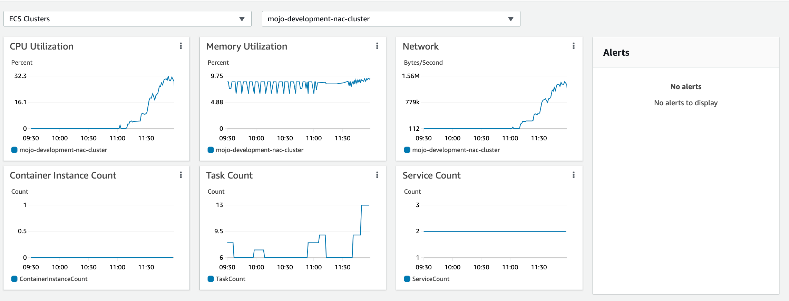
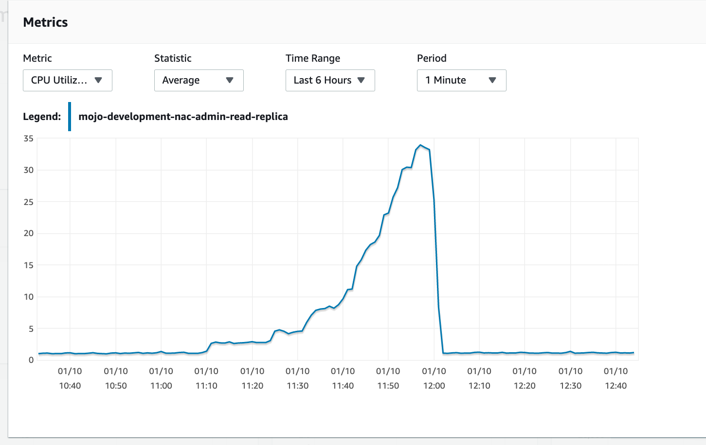
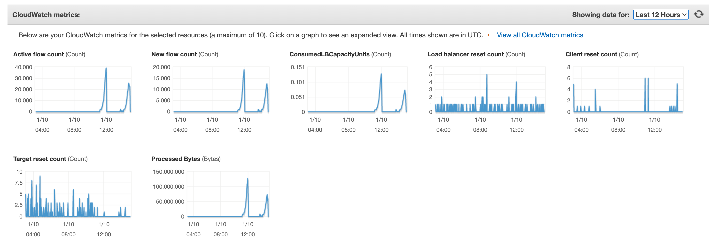

# Network Access Control Performance Testing

This documentation contains the results of the load test conducted on the 15th of October 2021.
- [FreeRADIUS Version 3.0.20](https://github.com/ministryofjustice/network-access-control-server/blob/main/Dockerfile) was the subject under test
- Hosted on [AWS infrastructure](https://github.com/ministryofjustice/network-access-control-infrastructure).
- The load testing tool that was used is [eapol_test v2.9](https://manpages.debian.org/testing/eapoltest/eapol_test.8.en.html).

## Configuration

- The radius servers run in a cluster with an auto-scaling group
- Radius runs on ECS Fargate and has WIP Memory and WIP CPU available
- The radius cluster is configured to use a read replica RDS MySQL instance. Sized at [db.t3.2xlarge](https://aws.amazon.com/rds/instance-types/)
- The dataset that was imported at the time of testing contained:
  - 2k Sites
  - Each site has a fallback policy (2k total)
  - Each site has 5 policies configured (10k in total)
  - Each site has 20 authorised clients (allowed sites) configured (40k in total)
  - Each fallback policy has one response (2k total)
  - Each policy has 5 rules configured (50k in total)
  - Each policy has 5 responses configured (50k in total)

## Considerations

- Tests are run from 10 EC2 [t4g.medium](https://aws.amazon.com/ec2/instance-types/) instances in the same VPC
- The tests were run with verbose logging enabled and disabled (WIP no performance impact observed)
- Each EC2 instance ran eapol_test in 1 thread in a continuous loop
- The timeout for a test was set to 3 seconds
- (WIP retries)
- Due to this being a new service, no existing volumetrics exist for comparison.
- EAP-TLS was used as the authentication mechanism
- Each authentication would execute the policy engine, return a custom response

## Test Command

[EAPOL test](https://manpages.debian.org/testing/eapoltest/eapol_test.8.en.html) was used for performance testing.

The following command was run from the test instances.

```sh
teapol_test -r0 -c test.conf -a$load_balancer_ip -s "PERFTEST"
```

test.conf

```sh
network={
    ssid="somessid"
    key_mgmt=WPA-EAP
    eap=TLS
    identity="user@example.org"
    ca_cert="ca.pem"
    client_cert="client.pem"
    private_key="client.pem"
    private_key_passwd="secret"
    eapol_flags=3
}
```

## Load test results - 15th October 2021

The test results indicate that the current NACS service handle **approximately xxx authentications per second**. This test was performed multiple times and the results were observed to be consistent.

### Hypothetical usage scenario

WIP 
[number of devices]
[number of re-authentications]
[roaming]

If 20k devices were to use the service in a working day (8 hours), with a lease time of 1 day, it would result in 0.7 lease requests per second.
This number only applies when traffic is spread evenly over an 8 hour working day and it is understood that there will be peaks and dips in traffic throughout the day.

```
20000 / 8 / 60 / 60 = 0.69
```


### DORA


### ECS - Elastic Container Service



### RDS - Relational Database Service




### NLB - Network Load Balancer



## How to run these tests

The performance tests are stored in version control as infrastructure as code, and can be run by enabling the performance.