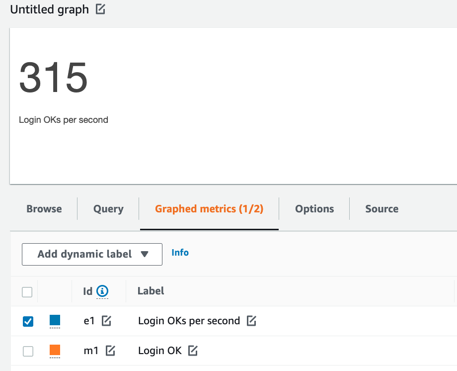
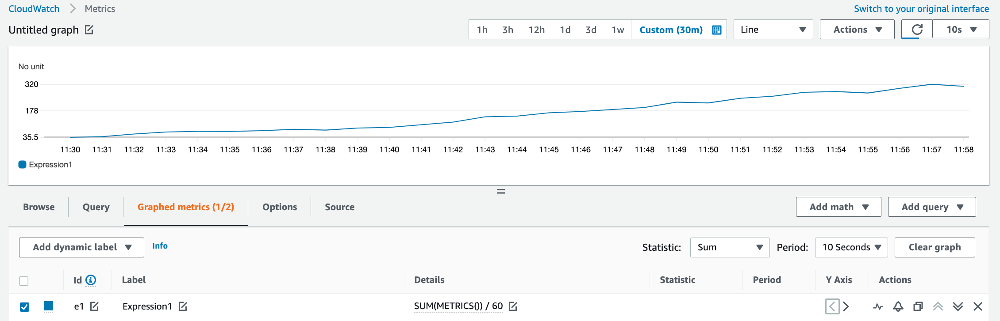
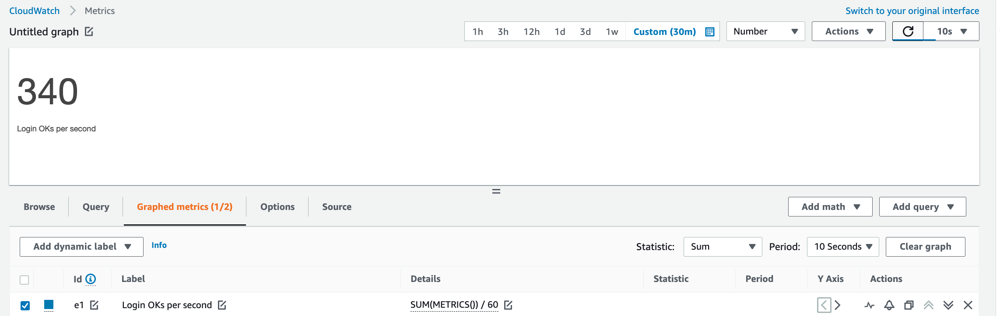
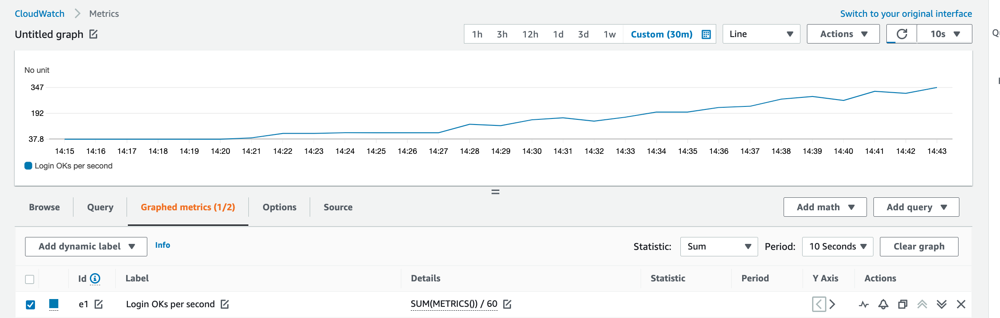
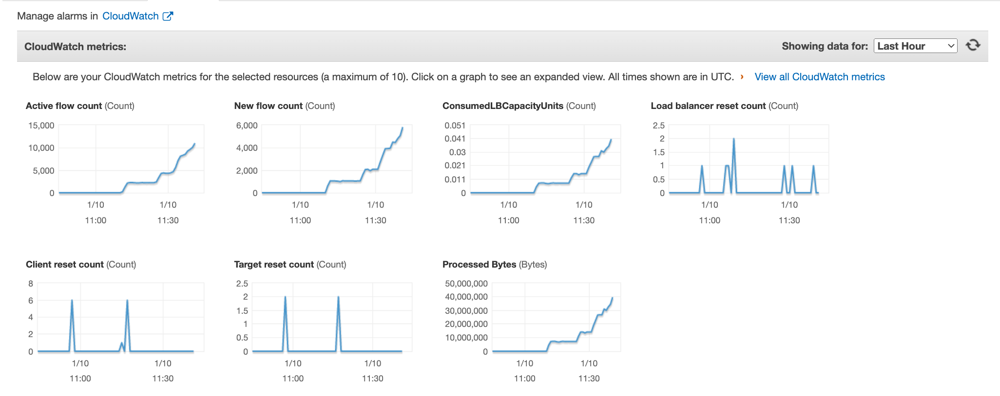

# Network Access Control Performance Testing

This documentation contains the results of the load test conducted on the 20th of October 2021.

- [FreeRADIUS Version 3.0.20](https://github.com/ministryofjustice/network-access-control-server/blob/main/Dockerfile) was the subject under test
- Hosted on [AWS infrastructure](https://github.com/ministryofjustice/network-access-control-infrastructure).
- The load testing tool that was used is [eapol_test v2.9](https://manpages.debian.org/testing/eapoltest/eapol_test.8.en.html).
- Given no NACS service currently exists, a direct comparison of these results can't be done, but it is not expected to cross these limits based on the amount of sites to be onboarded. 
- The limits that were encountered are not final and the service could be scaled beyond this.

## Configuration

- The Radius servers run in an auto-scaling cluster
- The Radius servers autoscaled up to 20 at peak load
- The server connects to a single RDS read replica [db.t3.2xlarge](https://aws.amazon.com/rds/instance-types/)
- Each server has 2048 Memory and 1024 CPU available
- 20 [t4g.medium](https://aws.amazon.com/ec2/instance-types/) EC2 instances were created as test clients with eapol_test running in a loop

## Data set

The data set that was imported at the time of testing contained:

  - 1750 sites
  - 2750 policies, shared between sites
  - Each site has 5 policies configured
  - Each site has 10 authorised clients (allowed sites) configured (40k in total)
  - Each fallback policy has one response (1750 total)
  - Each policy has 5 rules configured (13750 in total)
  - Each policy has 5 responses configured (13750 in total)

## Considerations

- The tests were run with verbose logging enabled. This had no negative performance impact on the service
- Tests were run for roughly 2 hours, traffic was gradually ramped up over this period
- The timeout for a test was set to 3 seconds
- Retries were not implemented
- EAP-TLS was used as the first authentication method
- MAC Authentication Bypass with MD5 was used as the MAB authentication method
- Each authentication would execute the policy engine, and return a custom response from the database
- Connecting to OCSP was not a part of this test. The service was tested in isolation
- The service runs in 3 availability zones in AWS, each with a dedicated IP address as the entry point. These IP addresses were randomised and passed to the tests

## Updates to service during testing to reach desired numbers

- Updates to database schema to ensure optimal performance
- Auto scaling fine tuned to scale on amount of packet count per container processed (10k packets over a sustained period of time)
- Database was set to t3.2xlarge, reset back to t3.large after test was completed to save on AWS costs

## Load test results for EAP-TLS

The EAP-TLS test results indicate that the current NACS service can handle **approximately 315 authentications per second**. This test was performed multiple times and the results were observed to be consistent. It was noted that the database CPU was the main bottleneck during testing.





### ECS - Elastic Container Service


### RDS - Relational Database Service


### NLB - Network Load Balancer


## Load test results for MAB

The MAB test results indicate that the current NACS service can handle **approximately 340 authentications per second**. This test was performaned multiple times and the results were observed to be consistent. 





### NLB - Network Load Balancer



### Deployments during peak load

A zero downtime deployment was done during peak load. This did not cause any service disruption.

## How to run these tests

The performance tests are stored in version control as infrastructure as code, and can be run by enabling the performance testing module.

- Generate self signed CA and client certificates and upload to performance testing S3
bucket using the following [guide](https://github.com/ministryofjustice/network-access-control-infrastructure/blob/main/documentation/performance_testing.md#generating-and-signing-the-performance-test-certificates).
- Ensure these are installed on the Freeradius servers.  This can be done through the admin interface.
- Generate required seed data for the policy engine. This can be found in the [admin github repo](https://github.com/ministryofjustice/network-access-control-admin/blob/main/db/seeds.rb).

## Test Command

[EAPOL test](https://manpages.debian.org/testing/eapoltest/eapol_test.8.en.html) was used for performance testing.

The following command was run from the test instances.

```sh
while true
 do
	array[0]="18.x.x.x"
	array[1]="19.x.x.x"
	array[2]="20.x.x.x"
	size=${#array[@]}
	index=$(($RANDOM % $size))

 	eapol_test -r0 -t3 -c test.conf -a"${array[$index]}" -s "PERFTEST" > /dev/null
	sleep 0.5
 done
```

test.conf

```sh
network={
    ssid="somessid"
    key_mgmt=WPA-EAP
    eap=TLS
    identity="user@example.org"
    ca_cert="ca.pem"
    client_cert="client.pem"
    private_key="client.pem"
    private_key_passwd="secret"
    eapol_flags=3
}
```
