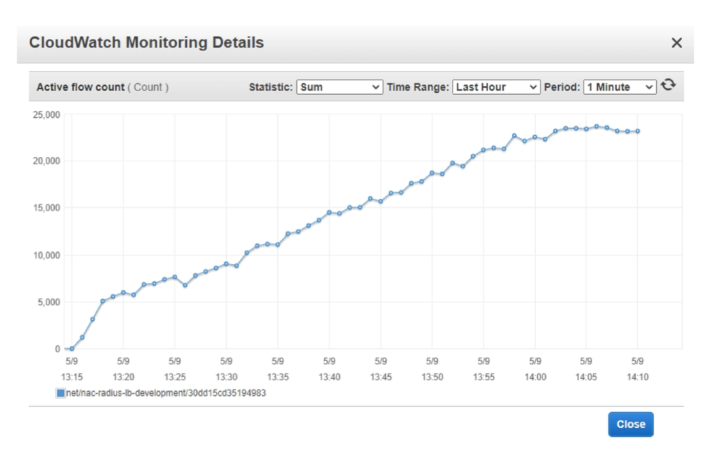
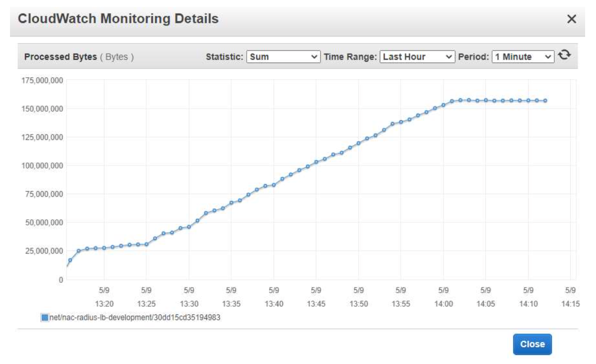
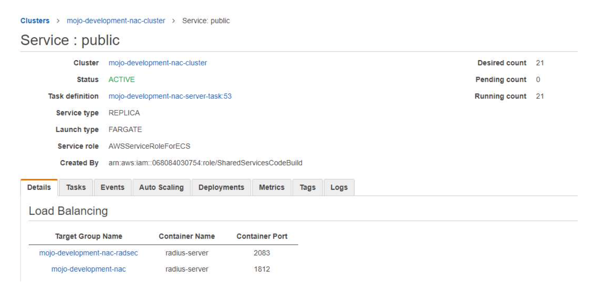

# Network Access Control RADSEC Performance Testing

This documentation contains the results of the load test conducted on the 10th of May 2022. The intention of this test was to establish whether an upper limit exists for a large number of concurrent RADSEC TLS connections. The tests were run against the development environment for NACS.

- [FreeRADIUS Version 3.2.0](https://github.com/ministryofjustice/network-access-control-server/blob/main/Dockerfile) was the subject under test
- Hosted on [AWS infrastructure](https://github.com/ministryofjustice/network-access-control-infrastructure)
- The load testing tool that was used is [radsec_proxy 1.9.0](https://radsecproxy.github.io/)

## Configuration

- The Radius servers run in an auto-scaling cluster
- The Radius servers autoscaled up to 21 at peak load
- Each server has 2048 Memory and 1024 CPU available
- 30 [t4g.large](https://aws.amazon.com/ec2/instance-types/) EC2 instances, each with ~400 containers were created as test clients with radsecproxy step scaling TLS connections. This results in ~12k clients making TLS connections at the same time.

## Load test results for RADSEC

A total number of ~25k concurrent RADSEC TLS connections were observed at the time of testing. This cause an auto scaling event and the number of containers running to deal with this load scaled out from 3 to 21.

### NLB - Network Load Balancer concurrent connections

### NLB - Network Load Balancer processed bytes

### ECS - Elastic Container Service

## How to run these tests

The performance tests are stored in version control as infrastructure as code, and can be run by enabling the performance testing module.

- Generate self signed CA / client and install them in the NACS admin portal. Upload the CA as a RADSEC CA.

## Test Command

The code for the tests can be found in the infrastructure repository [here](https://github.com/ministryofjustice/network-access-control-infrastructure/blob/main/modules/performance_testing/user_data_radsec.sh).
